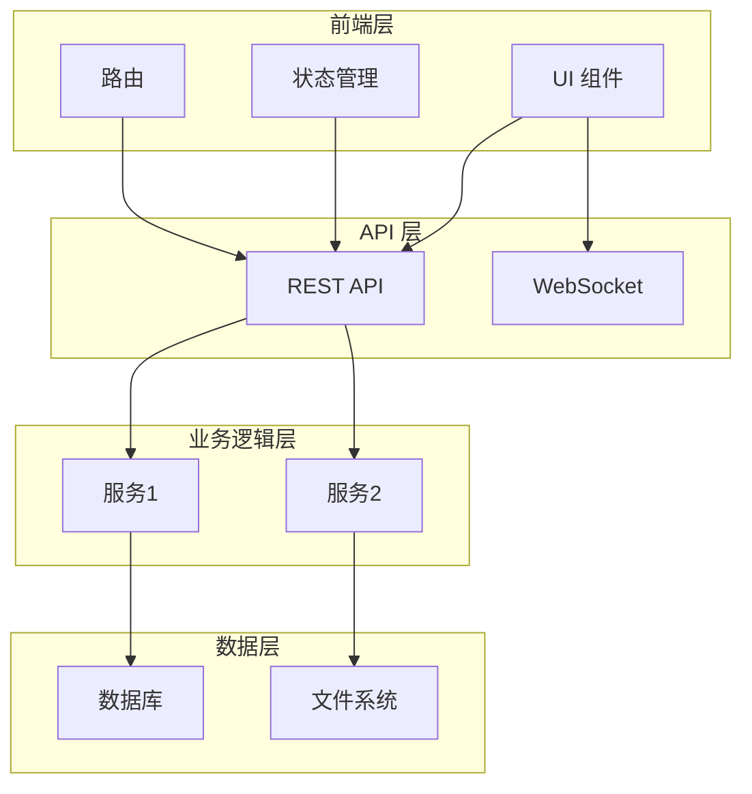
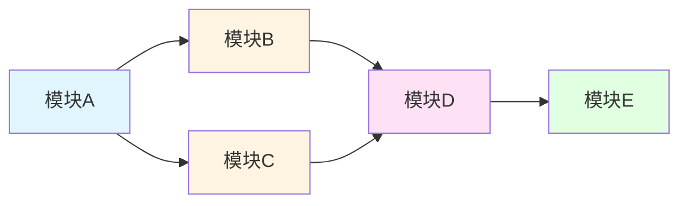
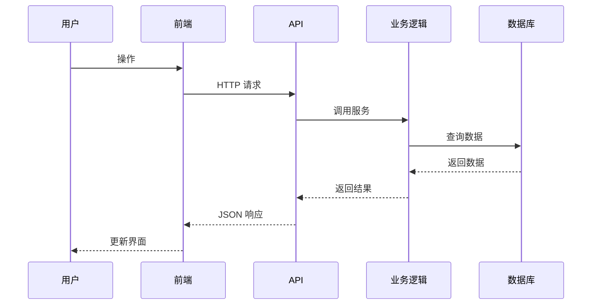
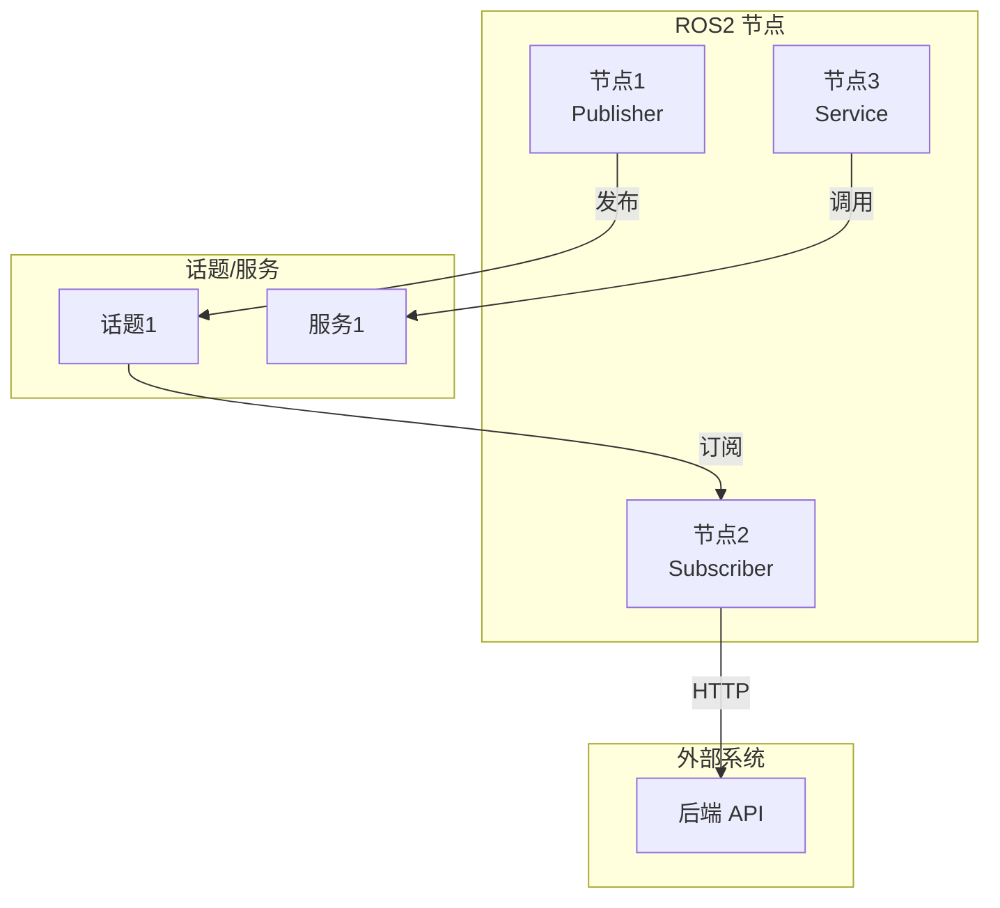
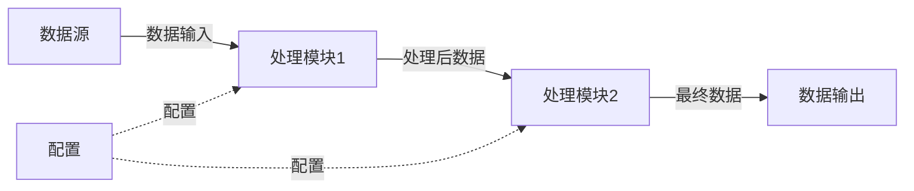
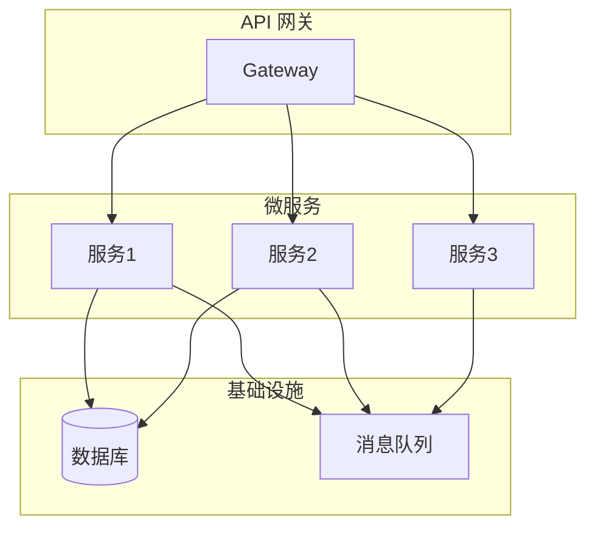
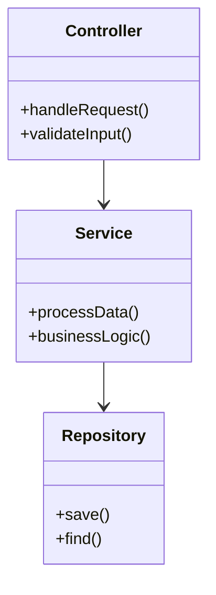

# 框架图模板

本文档提供 Mermaid 图表模板，用于生成项目框架图。

## 架构图模板

### 分层架构图

### 模块关系图

### 组件交互图

## ROS2 节点图模板

## 数据流图模板

## 微服务架构图模板

## 类图模板

## 使用说明

1. **选择合适的图表类型**
   - 架构图：展示系统整体结构
   - 模块关系图：展示模块依赖
   - 序列图：展示交互流程
   - 数据流图：展示数据处理流程

2. **自定义样式**
   - 使用 `style` 为节点添加颜色
   - 使用不同的箭头类型表示不同的关系
   - 使用子图组织相关节点

3. **保持简洁**
   - 避免在一个图中包含过多节点
   - 使用分层或分组组织复杂结构
   - 突出关键路径和核心模块

4. **中文标注**
   - 所有节点和关系使用中文标注
   - 确保图表易于理解

## Mermaid 语法参考

- **流程图**：`graph TB`（从上到下）、`graph LR`（从左到右）
- **序列图**：`sequenceDiagram`
- **类图**：`classDiagram`
- **状态图**：`stateDiagram-v2`
- **甘特图**：`gantt`

更多语法参考：[Mermaid 官方文档](https://mermaid.js.org/)
