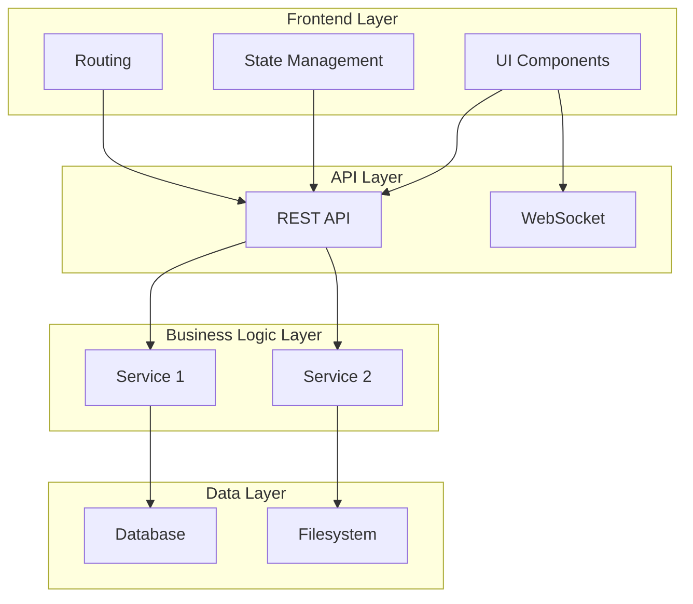
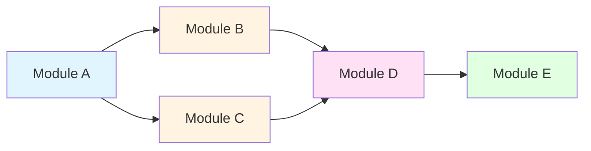
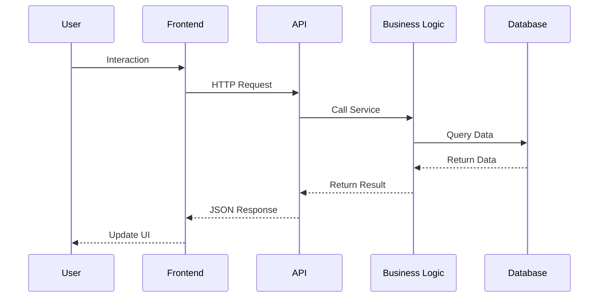
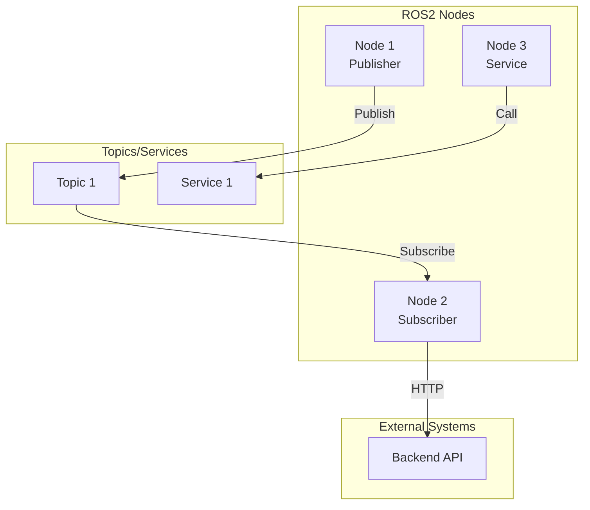
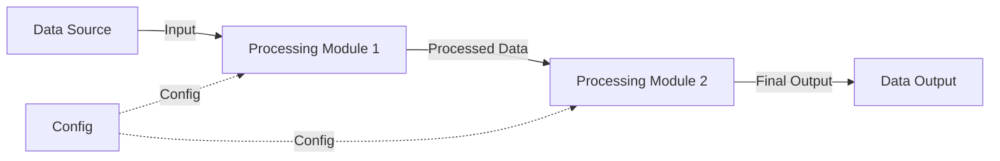
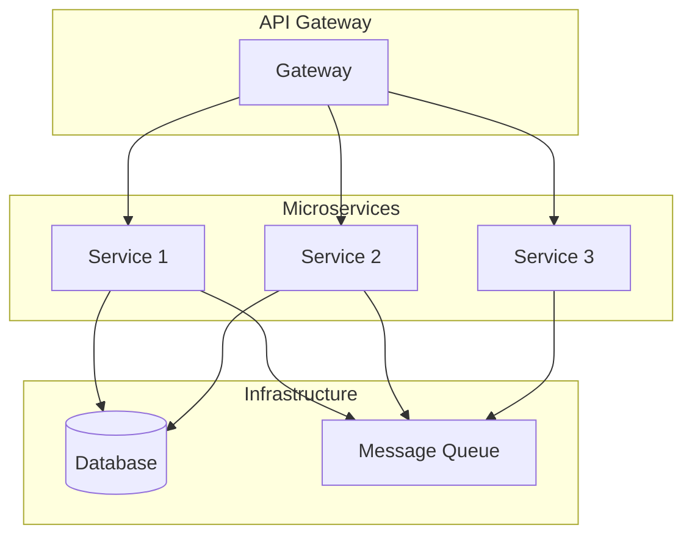
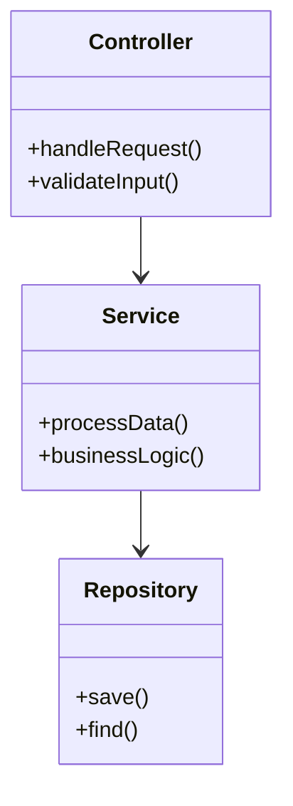

# Framework Diagram Templates

This document provides Mermaid templates for generating project framework diagrams.

## Architecture Diagram Templates

### Layered Architecture Diagram

### Module Relationship Diagram

### Component Interaction Diagram

## ROS2 Node Diagram Template

## Data Flow Diagram Template

## Microservices Architecture Diagram Template

## Class Diagram Template

## Usage Notes

1. **Choose the right diagram type**
   - Architecture diagram: overall system structure
   - Module relationship diagram: module dependencies
   - Sequence diagram: interaction flow
   - Data flow diagram: data processing flow

2. **Customize styles**
   - Use `style` to add node colors
   - Use different arrow types for different relationships
   - Use subgraphs to group related nodes

3. **Keep it concise**
   - Avoid too many nodes in a single diagram
   - Use layering or grouping for complex structures
   - Highlight critical paths and core modules

4. **Labeling**
   - Use consistent labels for nodes and edges
   - Ensure readability

## Mermaid Syntax Reference

- **Flowchart**: `graph TB` (top-down), `graph LR` (left-right)
- **Sequence diagram**: `sequenceDiagram`
- **Class diagram**: `classDiagram`
- **State diagram**: `stateDiagram-v2`
- **Gantt chart**: `gantt`

More syntax references: [Mermaid Documentation](https://mermaid.js.org/)
